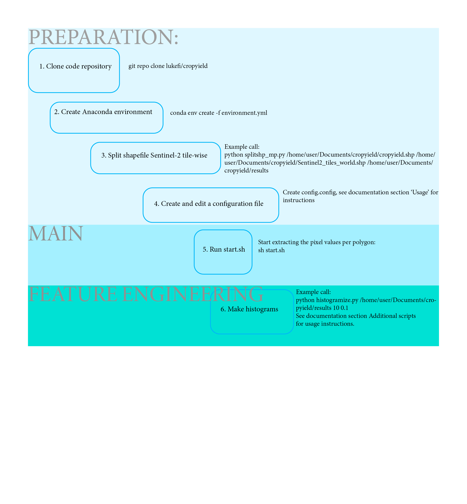

Introduction
============

In this task, raster data from Copernicus Sentinel-2 Level 2A tiles are processed. Pixel values are extracted from images and these values 
are further compressed into histogram values.

The scripts were run on an area of interest comprising the whole of 
Finland, as our reference data of historical crop yields cover the whole arable land in 
Finland. The time series were created for the growing season, that is from the 1st of 
May until the 1st of September. We utilized 10 bands (2,3,4,5,6,7,8,8A,11,12) of the 
Sentinel-2 image. Each band is stored in a separate geoTIFF. For example, in 2018, we 
have 2.9Tb of data from 64 tiles, all together 42,930 images. The amount of data to 
process is very costly in time and expense. Therefore, for this task, the processing 
pipeline was designed to be used on high performance computing servers. We have used Puhti 
supercomputer at the governmental CSC IT Centre for Science.

The figure below shows the processing workflow in a nutshell. This documentation describes each phase in details.

